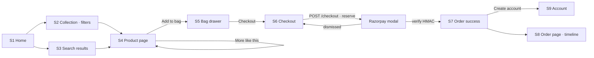
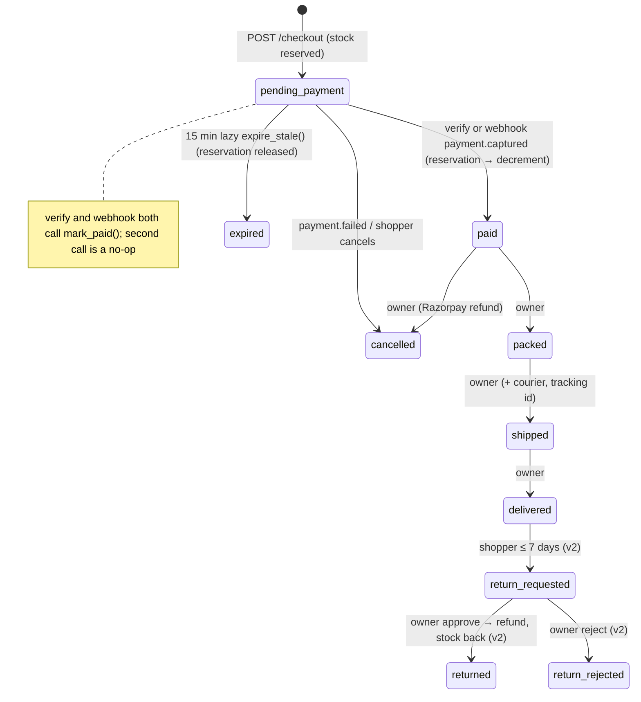
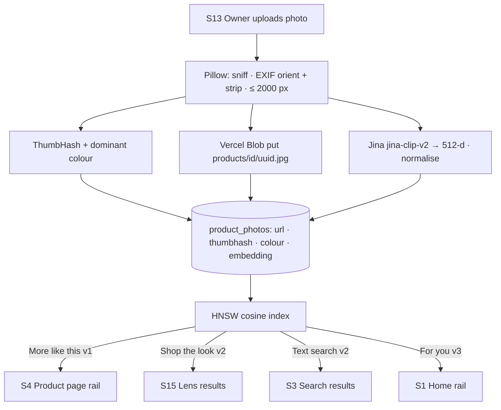
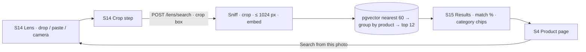
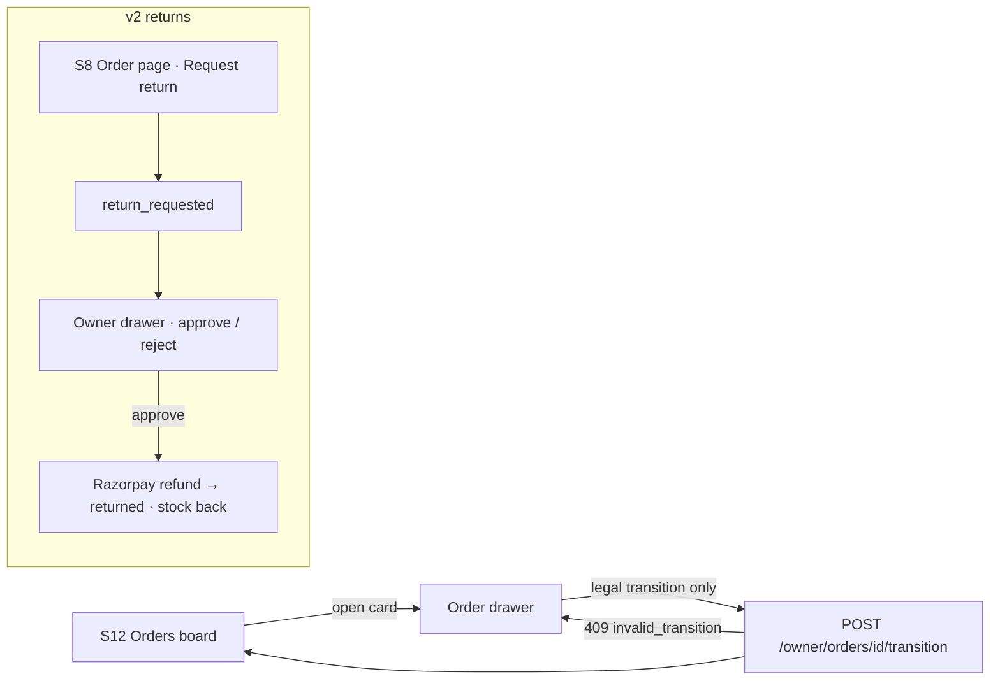

# Offcut — User Flows & Screen Index

**Lifecycle step:** 3 of 17 · **Locked:** 2026-09-17 · Pairs with [03-requirements.md](03-requirements.md); every screen below gets a mockup in [04-ui-mockups.md](04-ui-mockups.md).

## Flow 1 — Browse to paid (v1, the main path)



## Flow 2 — Order lifecycle (v1 state machine, v2 returns)



## Flow 3 — Reserve → pay → confirm (v1)

```mermaid
sequenceDiagram
  participant S as Shopper (web)
  participant API as FastAPI
  participant PG as Postgres
  participant RZ as Razorpay
  S->>API: POST /checkout {cart, contact, address}
  API->>PG: expire_stale(); lock variants (id order); reserved += qty where stock − reserved ≥ qty
  PG-->>API: all lines ok (else 409 out_of_stock)
  API->>RZ: create order (amount paise)
  API->>PG: insert orders(pending_payment, razorpay_order_id)
  API-->>S: {order_id, razorpay_order_id, key_id}
  S->>RZ: Standard Checkout modal (test card)
  RZ-->>S: {payment_id, signature}
  S->>API: POST /checkout/{id}/verify
  API->>PG: mark_paid(): paid; stock −= qty; reserved −= qty
  RZ->>API: POST /webhooks/razorpay payment.captured
  API->>PG: mark_paid() → already paid → no-op; webhook_events insert
```

## Flow 4 — Photo ingest: the image pipeline (v1)



## Flow 5 — Shop the look (v2)



## Flow 6 — Owner: orders board (v1) and returns (v2)



## Screen index

| # | Screen | Route | Who | Version | Notes |
|---|---|---|---|---|---|
| S1 | Home | `/` | shopper | v1 · For you in v3 | Exists as landing; becomes the store home (hero drop, categories, New in, Lens teaser) |
| S2 | Collection | `/shop`, `/shop/[category]` | shopper | v1 | Grid, URL filters, sort |
| S3 | Search results | `/search?q=` | shopper | v1 · hybrid in v2 | Full-text; v2 adds semantic hint |
| S4 | Product page | `/p/[slug]` | shopper | v1 | Gallery blur-up, variants, stock, **More like this**; v2 "Search from this photo" |
| S5 | Bag drawer | any page | shopper | v1 | Lines, stepper, stock re-check |
| S6 | Checkout | `/checkout` | shopper | v1 · discounts in v3 | Contact, address, summary → Razorpay modal |
| S7 | Order success | `/orders/[number]?key=` | shopper | v1 | Create-account offer |
| S8 | Order page + Track | `/orders/[number]`, `/track` | shopper / guest | v1 · returns in v2 | Timeline; number + email lookup |
| S9 | Account | `/account`, `/account/addresses` | shopper | v1 | Orders, address book |
| S10 | Sign in / up | `/sign-in`, `/sign-up` | all | v1 | Demo buttons |
| S11 | Owner: products | `/owner/products`, `/owner/products/[id]` | owner | v1 · near-dup in v3 | Table; editor with variant matrix |
| S12 | Owner: orders board | `/owner/orders` | owner | v1 · returns in v2 | Columns by state, drawer with legal transitions |
| S13 | Owner: photos + pipeline | `/owner/products/[id]` panel | owner | v1 | Drop zone, per-photo pipeline status (colour swatch, embedded ✓) |
| S14 | Owner: inventory | `/owner/inventory` | owner | v1 · alerts in v3 | Stock / reserved / available, adjust with reason |
| S15 | Lens: drop + crop | `/lens` | shopper | v2 · multi-crop in v3 | The signature screen |
| S16 | Lens: results | `/lens` (state) | shopper | v2 · outfit board in v3 | Query pinned, 12 matches with %, chips |
| S17 | Owner: dashboard | `/owner` | owner | v2 | Revenue, orders, top products, low stock |
| S18 | Not found / sold out states | `/p/[slug]` states | shopper | v1 | Draft product 404; all-sold-out page |
